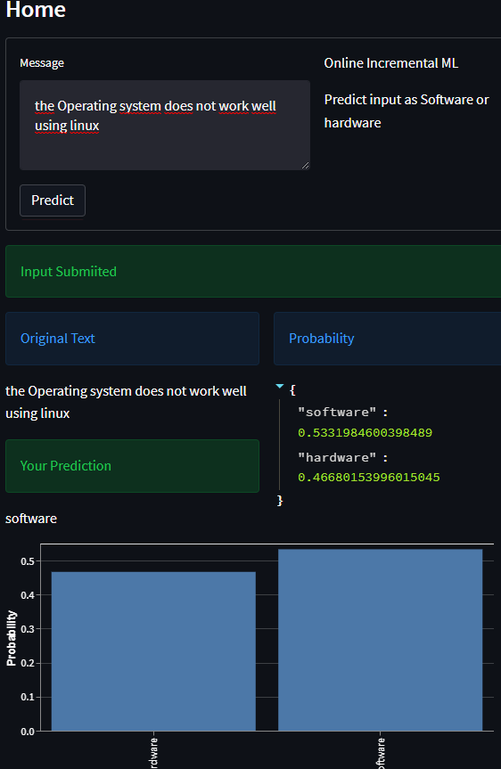
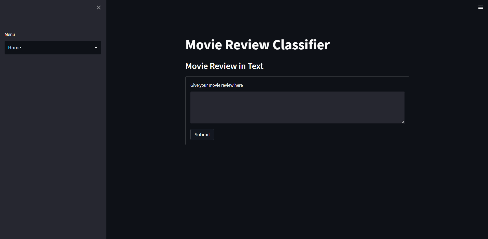
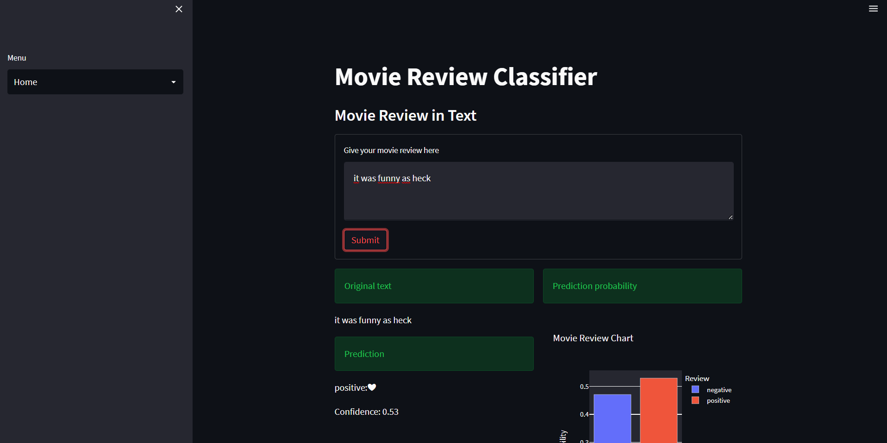

# Text Classification with Streamlit

    

## Using Incremental machine learning and Logistic Regression
### Goal
Build and deploy a web app using stream lit that classifies an input as either a software or a hardware and one that classifies movie review as either positive or negative

## Installation

`` git clone ``

``pip install requirements .txt ``

## Applications

These are the apps that were created in the process

|App | Description|
|-----|------------|
|app.py| uses incremental machine learning to classify a software or a hardware |
|app_2.py| classify movie review as positive or negative |

## Reviews
### Software reviews

#### Home page

1.  Movie Review Homepage

2. Example page

__NB__ The logistic regression score was  **88%**

 Contributors

 Peter Lugalia
